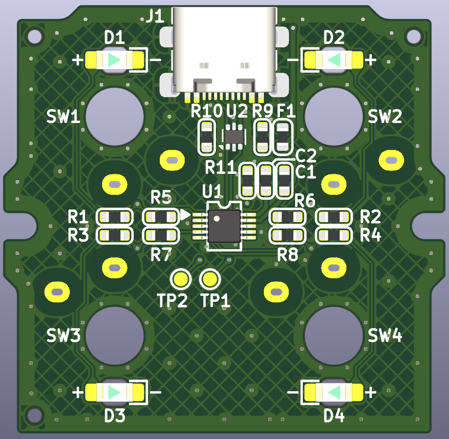

# ECmacro

A compact USB macro pad using low‑profile **Kailh Choc V2** mechanical switches. 
| Model | Key Count | Typical Use |
|-------|-----------|-------------|
| **MCmacro 04** | 4 keys | Copy / Paste / Undo / Redo |

---

## 🖼️ Gallery

---

## 📦 Features

- Low‑profile **Kailh Choc V2** mechanical switches  
- Ultra‑slim 4‑key layout（Choc spacing）  
- USB HID device with CH552 microcontroller
- Open-source hardware and firmware
USB VID/PID assigned via [pid.codes](https://pid.codes/) (requested: VID 0x1209 / PID 0xEC00, status: pending).

---

## 🖥️ Supported OS

- Windows 10/11
- macOS (10.14+)
- Linux (kernel with HID support)

---

## 🔍 Hardware Resources
  
- [Kicad ZIP](./hardware/mcmini04_kicad.zip)  

---

## 🧩 Firmware

- [Firmware (.ino)](./firmware/mcmacro04/mcmacro04.ino)  
  - This project uses [CH55xduino](https://github.com/DeqingSun/ch55xduino).  
    See the firmware directory for source code and pin assignment.
---

## 📄 License

This project uses dual licenses:

- **Firmware and source code**: [MIT License](./LICENSE-MIT.txt)
- **Schematics, PCB layout, and documents**: [CC BY 4.0](./LICENSE-CCBY.txt)

© 2025 QuadState

---

## 🆔 USB PID Registration

This project is in the process of registering a **USB Product ID (PID)** via [pid.codes](https://pid.codes/).  
The tentative assignment is:

- **Vendor ID**: `0x1209` (pid.codes community VID)
- **Product ID**: `0xEC00` (tentative)
- **PID.codes listing**: _Pending approval_

Once approved, the device will identify as:

---

## 💬 Contact & Feedback

Please use [GitHub Issues](https://github.com/QuadState/mcmacro/issues) for questions, bugs, or feedback.  
We welcome contributions, suggestions, and improvements!

---